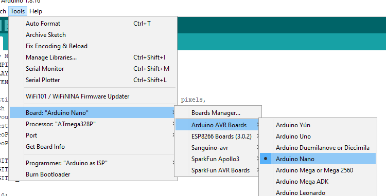
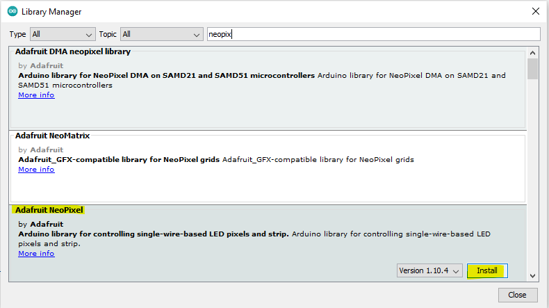
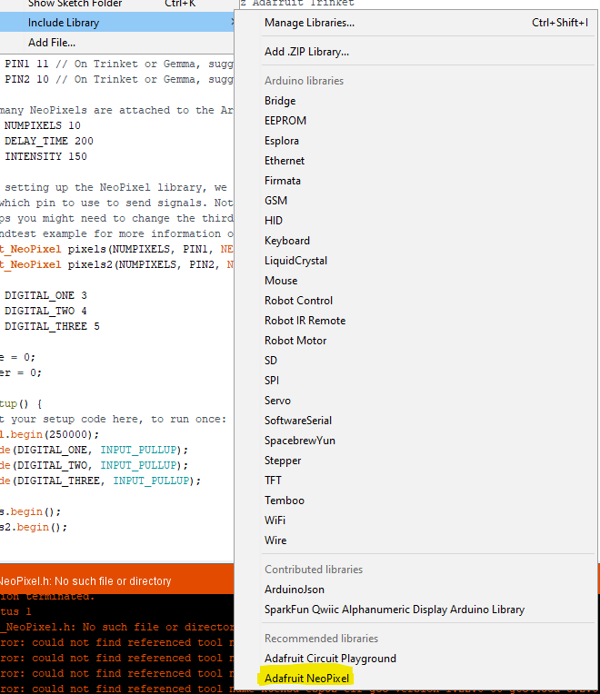

# Arduino Controlled RBG Status lights

Our robot using digital output signals from the RoboRio to set a number of different status to an Arduino Nano.  The Nano then controls a set of addressable LEDs (NeoPixels) with color and blink patterns.

From the RoboRio, we are currently using 3 digital outputs (DIO 0, 1, and 2).  That provides eight total states to work with (2^3).  Those three Rio outputs are fed into the Nano as digital inputs on D3, D4, D5.  A forth wire (grey) is ground between Rio and Nano.  The wires from the Nano are LSB is farthest from the grey.

## Tooling
1. Arduino IDE (https://www.arduino.cc/en/software)
1. Launch Arduino IDE, select Open and browse to source folder called RGBmode (containing RGBmode.ino).

## Setup
1. **Very Important** - Configure for the board. From the Menu, select Tools / Board: **** / Arduino AVR Boards / Arduino Nano

1. Load Adafruit's NeoPixel Library - From the Menu, select Sketch / Include Library / Manage Libraries...  Search for "neopixel" and install the Adafruit NeoPixel library.

1. Add Adafruit's Library to the sketch - From the Menu, select Sketch / Include Library / Adafruit NeoPixel

## Coding
Arduino is based on C.  Not much different than Java on the syntax basics, but memory management is very different.  Also memory on the Arduino is a limited resource.  The best approach is to copy code from an example and modify it for your needs.

Pushing code to an Arduino is usually an easy process (easy until something goes terribly wrong).  All you need is the right kind of USB cable.  For that Nano, that is the Mini-B USB cable.  Once connected to the Nano, set the COMM Port in the IDE.  Check your device manager if it is not obvious which COMM Port.

Once connected, the icons just below the File menu are your Verify (build) and Upload (deploy) operations.